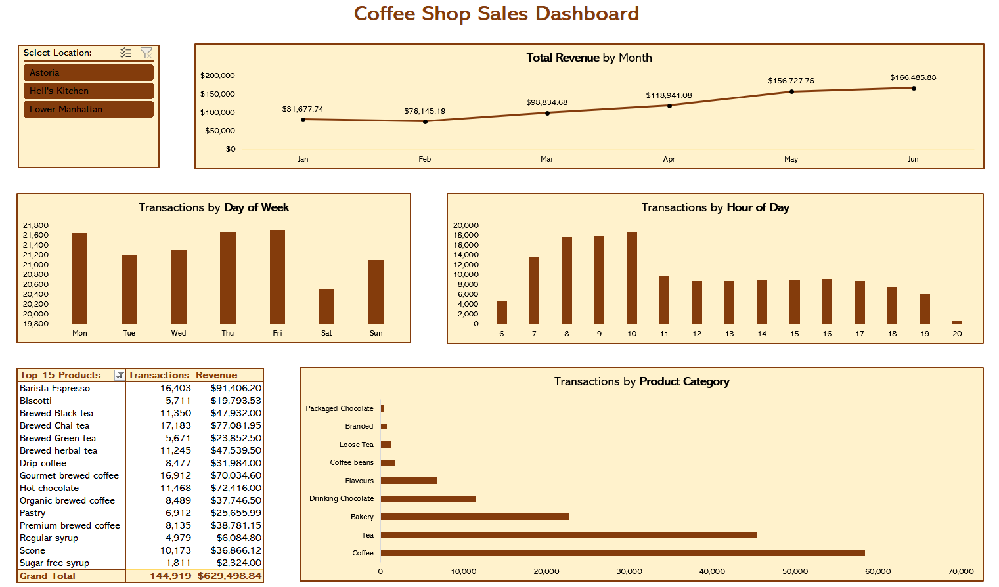

# ☕ Coffee Shop Dashboard

*A straightforward Excel-based analysis and interactive dashboard for Maven Roasters (three NYC locations, Jan-Jun 2023).*

---

## 📋 Table of Contents

1. [✨ Project Overview](#-project-overview)  
2. [📂 Data](#-data)  
3. [🚀 How to Open & Use](#-how-to-open--use)  
4. [🔍 Key Findings](#-key-findings)  
5. [📁 Folder Structure (Git Repo)](#-folder-structure-git-repo)
6. [💻 Tech Stack & Dependencies](#-tech-stack--dependencies)
7. [💡 Next Steps & Optional Enhancements](#-next-steps--optional-enhancements)  
8. [👩‍💻 Licence & Credit](#-licence--credit)
9. [📧 Contact](#-contact)

---

## ✨ Project Overview

### Situation:

Maven Roasters is a fictional small coffee-shop chain with three locations in New York City: *Astoria*, *Hell's Kitchen*, *Lower Manhattan*. During Jan-Jun 2023, every item-level transaction was recorded in Excel.

### Goal: 

Turn raw transactions into insights for franchisees, in order to identify patterns, trends and opportunities for the business. 

### Tasks:
- Prepare the raw data (calculate revenue, extract dates/times)
- Explore via PivotTables (monthly revenue, hourly/day-of-week patterns, product rankings)
- Build a dynamic dashboard with PivotCharts and a location slicer
  
---

## 📂 Data

All data is **fictional** (sourced from Maven Analytics).  
The single file **`Coffee Shop Sales.xlsx`** contains **three sheets**:

1. **`Transactions_raw`**  
   - Original POS export
     
2. **`Transactions_processed`**  
   - Same rows with **calculated fields**:  
     - Revenue
     - Month (1-6) & Month Name ("Jan"-"Jun")  
     - Weekday (1-7) & Weekday Name ("Mon"-"Sun")  
     - Hour (0-23)  

3. **`Dashboard`**  
   - **PivotCharts** + **Slicer** arranged on one sheet:  
     - Monthly Revenue Trend  
     - Transactions by Day of Week & Hour  
     - Top-15 Product Categories (by Transactions & Revenue)  
     - **Store Location** Slicer (Astoria, Hell’s Kitchen, Lower Manhattan)



---

## 🚀 How to Open & Use

1. **Download / Clone**  
   ```bash
   git clone https://github.com/la-retrouvaille/Data-Analysis-Projects/tree/main
   cd Data-Analysis-Projects/coffee-shop-sales

*- or simply download* `Coffee Shop Sales.xlsx.`

2. **Open in Excel (2016 or later)**
   - Double-click `Coffee Shop Sales.xlsx`
   - Enable Editing if prompted

3. **Inspect Sheets**
   - `Transactions_raw`: Review original data.
   - `Transactions_processed`: Confirm new columns (Revenue, Month, Weekday, Hour).

5. **Visit the Dashboard**
   - Click the `Dashboard` sheet.
   - Use the **Store Location** slicer (top-left) to filter by "Astoria", "Hell’s Kitchen", "Lower Manhattan", or view all.
   - Hover over chart elements to see precise values.

---

## 🔍 Key Findings

- **Strong Month-over-Month Growth**  

Revenue climbed steadily from *$76.1K* in February to *$166.5K* in June; a **119% increase** in just four months, with the largest jump between April (*$118.9K*) and May (*$156.7K*).  

- **Friday & 10 AM Are Peak**
  
**Friday** has the highest transaction volume (*21,701*), while **Saturday** is the slowest (*20,510*).  
The busiest single hour is **10 AM** (*18,545 transactions*), likely by the breakfast rush.
    
- **Coffee Dominates, Tea a Close Second**
   
The **Coffee** category accounts for *58,416* item-level transactions, followed by **Tea** (*45,449*) and **Bakery** (*22,796*).
    
- **Top 3 Products by Volume**
  
  1. **Brewed Chai tea**: *17,183* transactions (*$77.1K*)  
  2. **Gourmet brewed coffee**: *16,912* transactions (*$70.0K*)  
  3. **Barista Espresso**: *16,403* transactions (*$91.4K*) - highest revenue per sale (~$5.58)
     
- **Locations Are Evenly Matched**  

Hell’s Kitchen leads slightly (*$236.5K*), with Astoria (*$232.2K*) and Lower Manhattan (*$230.1K*) very close behind.

---

### Recommendations

1. **Optimize Staffing & Hours**  
   - Staff more baristas between **8 AM-11 AM**, especially on **Fridays**, to handle peak loads.  
   - Consider light coverage or targeted promotions during the early afternoon slump (12-2 PM).

2. **Promote High-Margin Items**  
   - Upsell or bundle **Barista Espresso** (highest revenue per transaction) with bakery items.  
   - Feature **Gourmet brewed coffee** and **Chai tea** in loyalty rewards to drive repeat visits.

3. **Target Slow Periods**  
   - Launch a **“February Warm-Up”** promo (e.g., discount on hot chocolate) to mitigate winter lull.  
   - Use targeted email or app notifications when foot traffic is forecasted to dip.

---

## 📁 Folder Structure (Git Repo)

- **coffee-shop-sales/**
  - [Coffee Shop Sales.xlsx](https://github.com/la-retrouvaille/Data-Analysis-Projects/blob/main/Coffee-Shop-Sales/Coffee%20Shop%20Sales.xlsx) <- Complete workbook (all three sheets)
  - [Coffee-Shop-Sales-Dashboard.PNG](https://github.com/la-retrouvaille/Data-Analysis-Projects/blob/main/Coffee-Shop-Sales/Coffee-Shop-Sales-Dashboard.PNG) <- Screenshot of the dashboard
  - [.gitignore](https://github.com/la-retrouvaille/Data-Analysis-Projects/blob/main/Coffee-Shop-Sales/.gitignore) <- Git rules: files/directories to ignore
  - [README.md](https://github.com/la-retrouvaille/Data-Analysis-Projects/blob/main/Coffee-Shop-Sales/README.md) <- This file  

> *Note: The entire analysis lives in `Coffee Shop Sales.xlsx`. No extra folders or scripts are required.*

---

## 💻 Tech Stack & Dependencies

Microsoft Excel (PivotTables, PivotCharts, Slicers).

---

## 💡 Next Steps & Optional Enhancements
 
- **Add Weather Data**  

  Merge daily temperature/precipitation to analyze weather vs. sales correlations.

- **Compare Advanced Models**  

  Export `Transactions_processed` to CSV and build Python/R models for improved forecasting beyond Excel capabilities.

- **Interactive Web Dashboard**  

  Use Power BI to host a web-accessible version so stakeholders without Excel can explore filters live.

- **Automate Data Refresh**  

  Create a simple Python script to fetch new POS data daily and auto-refresh PivotTables.

- **Location-Specific Insights**

  Compare day-part performance by store to tailor local promotions.
  Analyze demographic or foot-traffic data around each café to inform menu or pricing strategies.    

---

## 👩‍💻 Licence & Credit

This project is licensed under the **MIT License** - see the [LICENSE](https://github.com/la-retrouvaille/Data-Analysis-Projects/blob/main/LICENSE) file for details.

- **Data Source:** Fictional Maven Roasters POS Logs (Jan-Jun 2023) from Maven Analytics
- **Emojis & Icons:** [Emojipedia](https://emojipedia.org/)

---

## 📧 Contact

Egi Aliaj

[GitHub](https://github.com/la-retrouvaille) | [LinkedIn](https://www.linkedin.com/in/egialiaj/)

*Thank you for exploring this project! Feel free to ⭐ the repo if you found it helpful.*  
