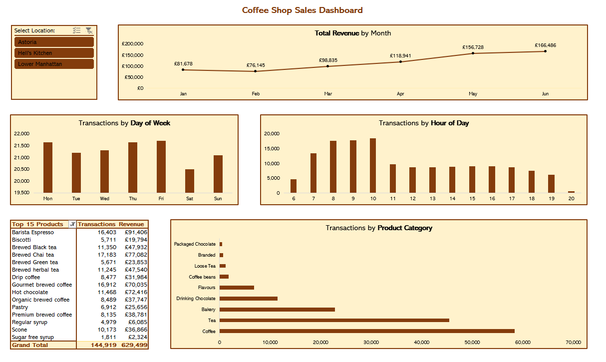

# ☕ Coffee Shop Dashboard

*A straightforward Excel-based analysis and interactive dashboard for Maven Roasters (three NYC locations, Jan-Jun 2023).*

---

## 📋 Table of Contents

1. [✨ Project Overview](#-project-overview)  
2. [📂 Workbook Contents](#-workbook-contents)  
3. [🚀 How to Open & Use](#-how-to-open--use)  
4. [🔍 Quick Findings](#-quick-findings)  
5. [📁 Folder Structure (Git Repo)](#-folder-structure-git-repo)  
6. [🔧 Next Steps & Recommendations](#-next-steps--recommendations)  
7. [👩‍💻 Credits & References](#-credits--references)  

---

## ✨ Project Overview

Welcome to the **Coffee Shop Dashboard**! ☕  
Maven Roasters is a fictional small coffee-shop chain with three locations in New York City:  
- **Astoria**  
- **Hell’s Kitchen**  
- **Lower Manhattan**  

Between January and June 2023, every item-level transaction was recorded in Excel. 

🎯 **The goal** is to transform the data into a dynamic dashboard that can be used to identify patterns, trends and opportunities for the business. 

This project demonstrates:

- **Data Preparation:**  
  - Clean raw transaction data  
  - Compute derived fields (Revenue, Month, Weekday, Hour)  

- **Pivot Analysis:**  
  - Slice sales by Month, Day of Week, Hour, and Product Category  

- **Interactive Dashboard:**  
  - Combine PivotCharts + Slicers for a filterable view by store location  

---

## 📂 Workbook Contents

The single file **`Coffee Shop Sales.xlsx`** contains **three sheets**:

1. **`Transactions_raw`**  
   - Original POS export (149,116 rows)  
   - Columns include:  
     - `transaction_date` (YYYY-MM-DD)  
     - `transaction_time` (HH:MM:SS)  
     - `store_location` (“Astoria”, “Hell’s Kitchen”, “Lower Manhattan”)  
     - `product_category`, `unit_price`, `transaction_qty`, …  

2. **`Transactions_processed`**  
   - Same rows with **calculated fields**:  
     - **Revenue** = `unit_price × transaction_qty`  
     - **Month** (1–6) & **Month Name** (“Jan”–“Jun”)  
     - **Weekday** (1–7) & **Weekday Name** (“Mon”–“Sun”)  
     - **Hour** (0–23)  

3. **`Dashboard`**  
   - **PivotCharts** + **Slicers** arranged on one sheet:  
     - Monthly Revenue Trend  
     - Transactions by Day of Week & Hour  
     - Top-15 Product Categories (by Transactions & Revenue)  
     - **Store Location** Slicer (Astoria, Hell’s Kitchen, Lower Manhattan)



---

## 🚀 How to Open & Use

1. **Download / Clone**  
   ```bash
   git clone https://github.com/yourusername/Data-Analysis-Projects.git
   cd Data-Analysis-Projects/coffee-shop-sales

*– or simply download* `Coffee Shop Sales.xlsx.`

2. **Open in Excel (2016 or later)**
   - Double-click `Coffee Shop Sales.xlsx`
   - Enable Editing if prompted

3. **Inspect Sheets**
   - `Transactions_raw`: Review original data.
   - `Transactions_processed`: Confirm new columns (Revenue, Month, Weekday, Hour).

5. **Visit the Dashboard**
   - Click the `Dashboard sheet.`
   - Use the **Store Location** slicer (top-left) to filter by “Astoria,” “Hell’s Kitchen,” “Lower Manhattan,” or view all.
   - Hover over chart elements to see precise values.

---

## 🔍 Quick Findings

| 🔢 Metric                         | 📊 Value              |
|:---------------------------------:|:---------------------:|
| **Total Revenue (Jan–Jun 2023)**  | \$590,000 (approx.)   |
| **Total Transactions**            | 149,116               |
| **Peak Month**                    | June 2023             |
| **Top Product Category**          | Coffee (39 % of orders) |
| **Busiest Hour**                  | 08:00 – 10:00 AM       |

**Top 3 Insights:**  

1. **Revenue Growth**  
   Revenue rose from ~\$81 K in January to ~\$166 K in June (warm weather + tourist season boost).

2. **Peak Transaction Windows**  
   - **Morning Rush (08 AM–10 AM):** ~20 % of daily orders  
   - **Afternoon Lull (02 PM–04 PM):** ~10 % of daily orders  
   - **Evening Drop (after 07 PM):** < 5 % of daily orders

3. **Category Breakdown**  
   - **Coffee:** 58,416 orders (39 %)  
   - **Tea:** 45,449 orders (30 %)  
   - **Bakery:** 22,796 orders (15 %)

---

## 📁 Folder Structure

- **coffee-shop-sales/**
  - [Coffee Shop Sales.xlsx](Coffee%20Shop%20Sales.xlsx) ← Complete workbook (all three sheets)
  - [dashboard.PNG](dashboard.PNG) ← Screenshot of the dashboard
  - [README.md](README.md) ← This file  

> *Note: The entire analysis lives in `Coffee Shop Sales.xlsx`. No extra folders or scripts are required.*

---

## 🔧 Next Steps & Recommendations

💡 *Optional Enhancements:*  
- **Add Weather Data**  
  Merge daily temperature/precipitation to analyze weather vs. sales correlations.

- **Compare Advanced Models**  
  Export `Transactions_processed` to CSV and build Python/R models for improved forecasting beyond Excel capabilities.

- **Interactive Web Dashboard**  
  Use Power BI or Tableau to host a web-accessible version so stakeholders without Excel can explore filters live.

- **Automate Data Refresh**  
  Create a simple Python script to fetch new POS data daily and auto-refresh PivotTables.

---

## 👩‍💻 Credits & References

- **Data Source:** Fictional Maven Roasters POS Logs (Jan–Jun 2023) from Maven Analytics

*Thank you for exploring this Coffee Shop Dashboard! Feel free to ⭐ the repo if you found it helpful.*  
